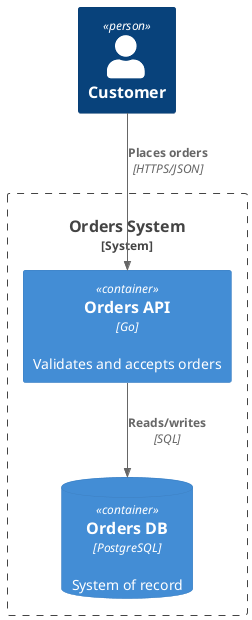
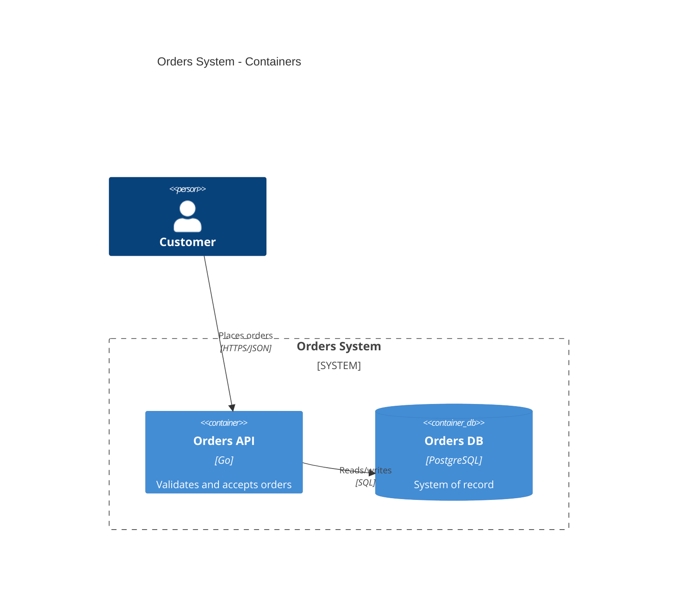

# C4 Modeling and Diagrams

The C4 levels, diagrams-as-code tooling, context/container/component patterns, and runtime and
deployment views.

## What C4 Is and Is Not

C4 (Simon Brown) is a way to describe a software system at four zoom levels with a small
vocabulary: person, software system, container, component, and code. It is not a notation
standard with a fixed visual grammar, and it is not UML. The value is consistency of zoom and
audience, not shapes.

Rules that keep C4 useful:

- Every diagram answers **one question for one audience** and is titled, dated, and versioned.
- Never mix levels: a container diagram does not show classes; a context diagram does not show
  databases unless they are systems someone else owns.
- Show **technology choices on container diagrams** (for example "API — Go, gRPC", "Bus —
  managed Kafka-compatible") because that is the level where technology matters.
- If a diagram needs a legend longer than five items, split it.
- Model once, render many: one source model, many generated views. Hand-maintained duplicates
  always diverge.

## The Four Levels

| Level | Audience | Shows | Typical elements |
|---|---|---|---|
| 1. System Context | Everyone, including non-technical | The system as one box, its users, and the other systems it depends on or serves | People, our system, external systems |
| 2. Container | Technical staff, ops, architects | Deployable/runnable units inside the system and how they communicate | Web app, API, worker, database, queue, cache |
| 3. Component | Developers of that container | Major building blocks inside one container and their responsibilities | Modules, services, adapters, repositories |
| 4. Code | Developers, only when needed | Classes/functions in one component | UML class/sequence, usually generated |

A container in C4 means anything that runs or stores: a process, a serverless function, a
database, a message broker topic-owned boundary, a browser SPA. "Container" has nothing to do
with Docker here. Say "container (deployable unit)" on first use to avoid confusion.

## Level 1: System Context

Purpose: scope and external dependencies. One box for your system, explicit external systems,
and the people who interact with it.

Pattern:

- Place the system in the center; users above/left, external systems around it.
- Label every arrow with intent ("submits orders", "reads customer profile via OIDC"), not
  protocol.
- Include systems that are easy to forget: identity provider, payment provider, email/SMS,
  analytics, on-prem ERP, regulator reporting endpoints.
- Mark which external systems you do not control and note their criticality.

Context checklist:

- [ ] Boundary of the system explicit (inside vs outside).
- [ ] Every actor is a person, a role, or an external system — no internal modules here.
- [ ] Every external dependency has an owner or vendor named.
- [ ] Data flows in both directions are shown where they exist.
- [ ] No technology detail beyond what a product manager needs.

## Level 2: Container

Purpose: the deployable and runtime topology of the system, and the communication between parts.

Pattern:

- One box per independently deployable unit and per stateful store.
- Label arrows with protocol and style: "HTTPS/JSON", "gRPC", "publishes events", "reads
  replica".
- Show synchronous calls solid and asynchronous messages dashed where the tool supports it.
- Include the store-and-forward infrastructure: broker, object storage, cache, search index.
- Group by trust/deployment zone (public edge, private network, data zone) when zones matter.

Container checklist:

- [ ] Every box can be deployed or scaled independently, or is a datastore.
- [ ] Every arrow has a protocol; every async arrow names the topic/queue.
- [ ] Data ownership visible: who writes each store.
- [ ] Third-party managed services are included and labeled as external.
- [ ] Failure domains visible: what happens if the broker or primary DB is down.

## Level 3: Component

Purpose: responsibilities inside one container, for the team that owns it. Do this only for
containers with real internal complexity; a thin CRUD API does not need one.

Pattern:

- Decompose by responsibility or bounded context, not by class.
- Show the dependency direction (controllers -> application services -> domain -> ports; adapters
  depend inward).
- Name the port/adapter seams so the diagram matches the fitness functions in code (see
  [./05-modularity-boundaries.md](./05-modularity-boundaries.md)).
- Include the outbound integrations of the container (broker publisher, external client).

Component checklist:

- [ ] One container per diagram; everything shown lives inside it.
- [ ] Each component has one sentence of responsibility.
- [ ] Dependency arrows match the enforced architecture rules.
- [ ] Cross-container interactions appear as boundary ports, not as foreign internals.
- [ ] The team that owns the container recognizes the diagram.

## Level 4: Code

Skip it by default. Generate class and sequence diagrams on demand from code or model, and never
curate them by hand. Keep generated ones out of review scope; they go stale fastest. Use them to
explain one tricky flow, then discard.

## Runtime and Deployment Views

Static structure is half the story. Add these views where they earn their place.

| View | Question it answers | When to add |
|---|---|---|
| Dynamic/sequence | How does one scenario flow, with ordering and failure paths? | Cross-container flows, retries, sagas, auth handshakes |
| Deployment | What runs where: environments, regions, cells, failover? | Multi-region, regulated data residency, capacity planning |
| Data flow | Where does a data category travel and rest? | Privacy/GDPR reviews, data residency, retention |
| Network/trust | Which zones, gateways, and identities exist? | Zero-trust design, partner integrations, audit |

Deployment diagram pattern:

- One diagram per environment class (production, staging), not per cluster.
- Show regions/zones, replication direction, and the failover path.
- Label traffic entry points (CDN, WAF, gateway) and private connectivity (peering, PrivateLink).
- Annotate data residency and backup targets.
- Keep infrastructure-specific detail out; link to infrastructure-as-code instead.

Dynamic diagram pattern:

- Number the steps; show the caller and callee at each step.
- Show timeouts, retries, and compensation only on the paths where they exist.
- Prefer one scenario per diagram; link alternatives.

## Diagrams as Code

Never hand-draw final diagrams. Pick one tool per organization and generate views from a model.

| Tool | Model | Strengths | Watch out |
|---|---|---|---|
| Structurizr DSL | Single workspace model, many views | True model/view separation, C4-native, CLI export to many formats | DSL learning curve; version the workspace file (verify current Structurizr release upstream) |
| PlantUML + C4-PlantUML | Per-diagram text | Ubiquitous, easy CI rendering, familiar to many | Each diagram is separate; no shared model unless scripted |
| Mermaid (C4 experimental) | Per-diagram text | Renders in many Markdown UIs with zero install | C4 support is experimental; verify current behavior upstream |
| D2 | Per-diagram text | Clean layout, good CLI | Less C4-specific convention |
| Modeling SaaS (IcePanel and similar) | Hosted model | Collaboration, links to code | Export/portability and pricing; keep a text export in the repo |

Structurizr DSL, minimal workspace:

```
workspace "Orders" {
  model {
    customer = person "Customer"
    orders = softwareSystem "Orders System" {
      api  = container "Orders API" "Go, gRPC/HTTP" "Accepts and validates orders"
      db   = container "Orders DB" "PostgreSQL" "System of record for orders"
      bus  = container "Event Bus" "Kafka-compatible" "Publishes order facts"
      api -> db "reads/writes"
      api -> bus "publishes order events"
    }
    billing = softwareSystem "Billing" "External to the team"
    customer -> orders "places orders"
    orders -> billing "sends invoices via HTTPS"
  }
  views {
    systemContext orders "Context" { include *; autolayout lr }
    container orders "Containers" { include *; autolayout lr }
    theme default
  }
}
```

PlantUML + C4 snippet:



Mermaid, minimal (verify C4 support upstream):



Operational tips:

- Render diagrams in CI and publish to the docs site; reviews diff text, not images.
- Add a freshness date or a `last-verified` field; a diagram without one is assumed stale.
- Link diagrams to ADRs and services (Backstage or equivalent catalog) so navigation is
  bidirectional.
- Keep the model in the same repo as the system when possible; a central catalog links out.

## Anti-Patterns

- **The everything diagram** — one container diagram with 40 boxes; split by subsystem or
  audience.
- **Level mixing** — classes on a container diagram, infrastructure zones on a context diagram.
- **Unlabeled arrows** — an arrow without protocol and intent carries no information.
- **Hand-drawn source of truth** — exported images committed without the source model.
- **Diagram-only architecture** — pictures without decisions; pair with ADRs
  ([./01-adr.md](./01-adr.md)).
- **Aspirational diagrams** — showing the target state without labeling it as such; mark "target"
  versus "current".
- **Orphan model** — a Structurizr workspace nobody updates; assign an owner per view.

## Checklist

- [ ] Each diagram names one audience and one question.
- [ ] Level boundaries respected; no mixing.
- [ ] Every element has a description; every relationship has a verb and protocol.
- [ ] Technology shown at container level only (plus deployment detail where relevant).
- [ ] External systems and their owners included.
- [ ] Sources are text, in version control; renders generated in CI.
- [ ] Freshness metadata present; owner assigned.
- [ ] Context/container views link to relevant ADRs.
- [ ] Deployment and dynamic views added where failure or data residency matters.

## Related

- Recording the decisions the diagrams embody: [./01-adr.md](./01-adr.md)
- Enforcing the component dependencies shown: [./05-modularity-boundaries.md](./05-modularity-boundaries.md)
- Publishing and maintaining the docs site: [./10-documentation-governance.md](./10-documentation-governance.md)
